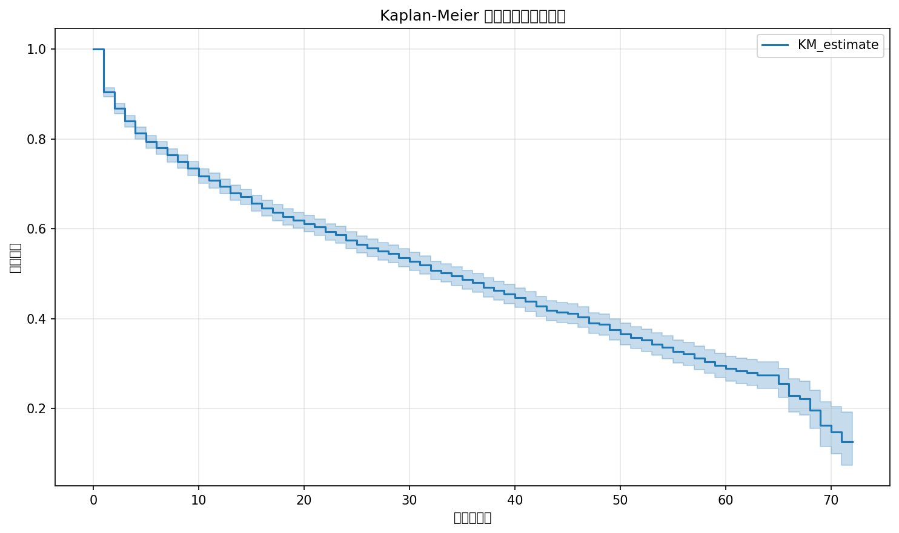
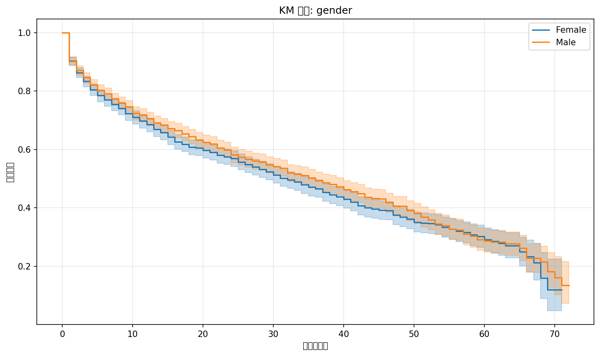
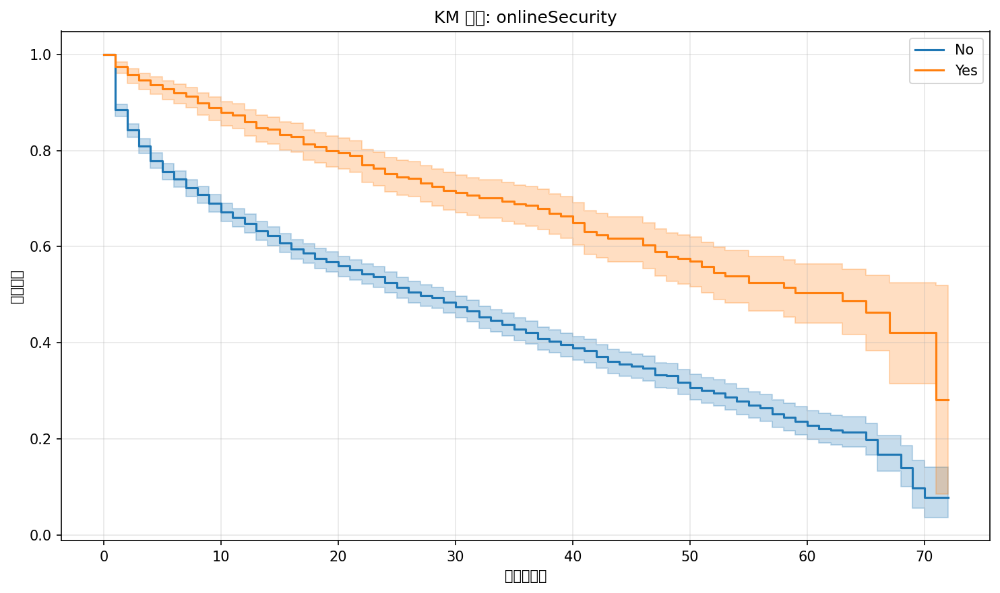
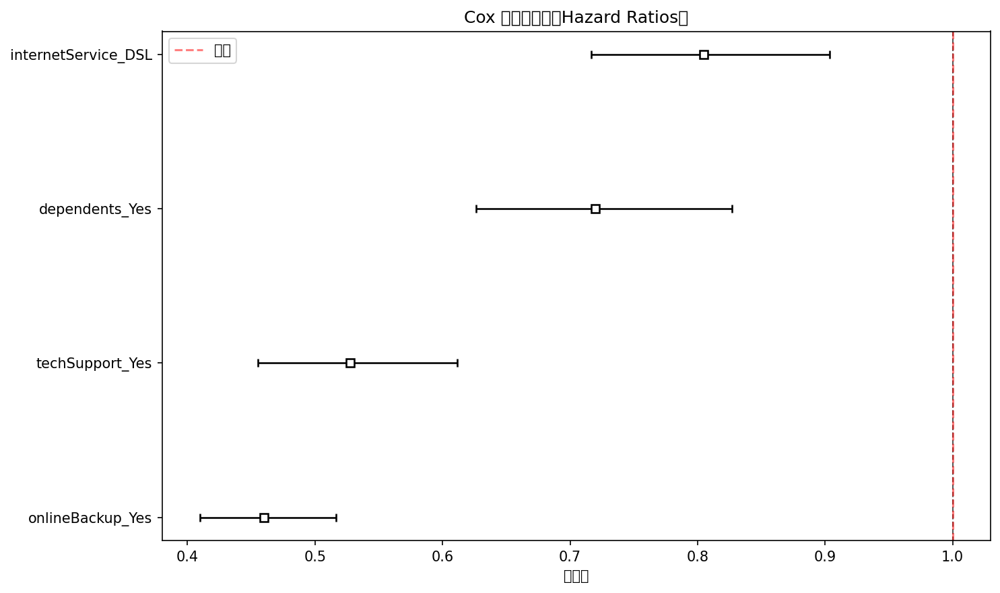
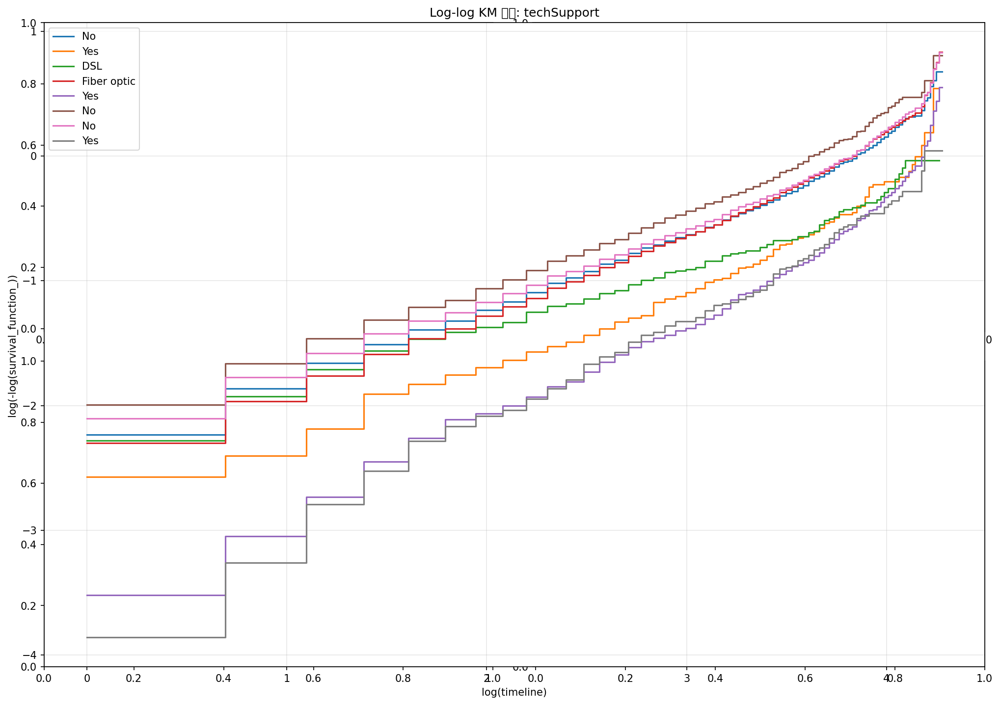
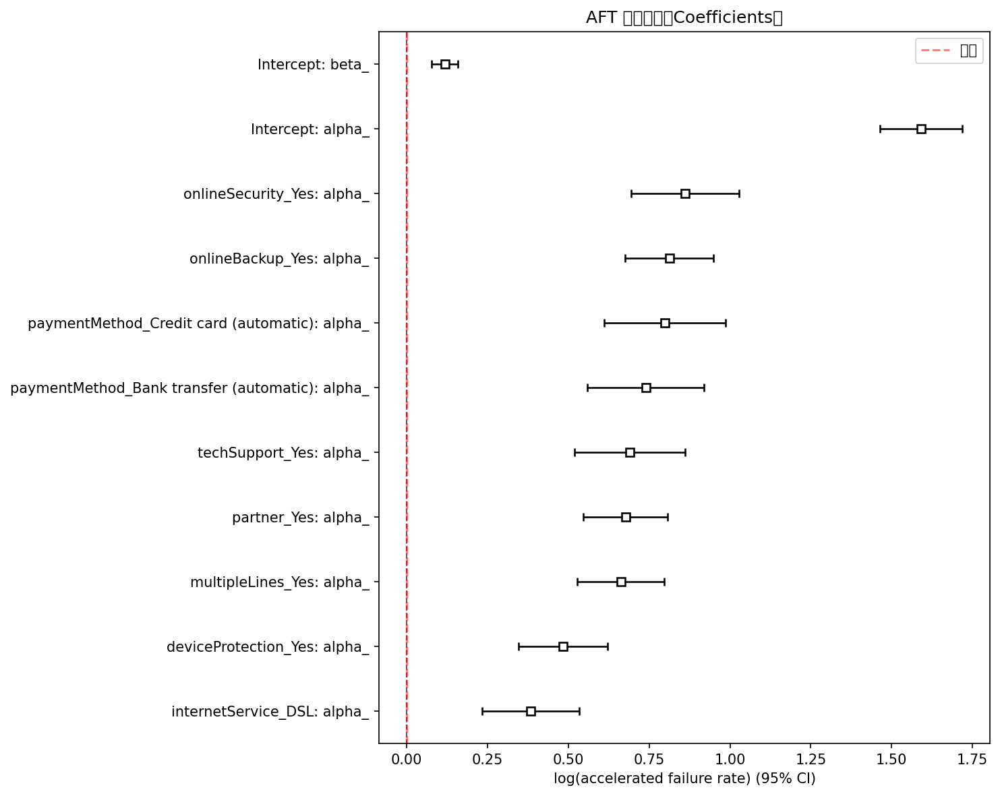
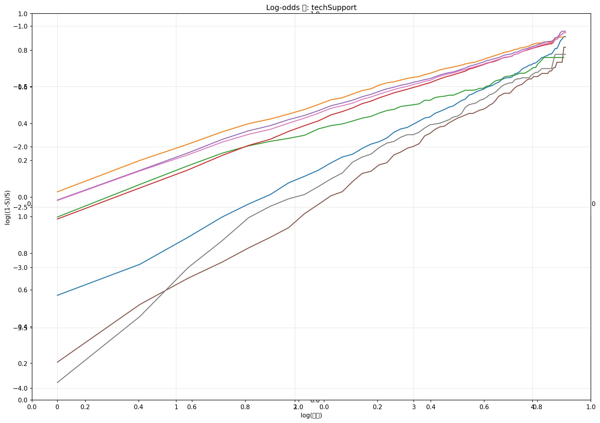
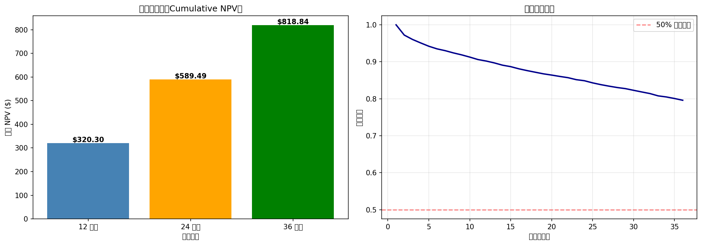

# Q2 生存分析实验报告

**学生姓名：** 傅航  
**学号：** 12310527  
**提交日期：** 2026年4月26日  
**数据集：** IBM Telco Customer Churn  
**分析方法：** Kaplan-Meier、Cox 比例风险模型、AFT 模型、CLV 计算

---

## 1. 实验背景与目标

客户流失（Churn）预测是电信行业的核心业务问题。传统分类模型（如逻辑回归）只能预测"是否流失"，而**生存分析**能进一步回答"何时流失"，为客户保留策略提供时间维度的洞察。

本实验基于 [Databricks Survival Analysis Solution Accelerator](https://github.com/databricks-industry-solutions/survival-analysis) 教程，使用 `lifelines` 库实现三种生存分析方法：

1. **Kaplan-Meier**：非参数方法，估计生存概率曲线
2. **Cox 比例风险模型**：半参数方法，多变量分析
3. **AFT（加速失效时间）模型**：全参数方法，直接建模生存时间
4. **CLV（客户生命周期价值）**：基于 Cox 生存概率的 NPV 计算

---

## 2. 数据集说明

- **数据集名称**：IBM Telco Customer Churn
- **原始记录数**：7,043 条，21 列
- **筛选条件**：Month-to-month 合同 + 有互联网服务
- **Silver 表记录数**：3,351 条
- **流失率**：46.43%
- **生存时间（tenure）**：客户在网月数（1–72 个月）

---

## 3. 方法论

### 3.1 Kaplan-Meier 估计

非参数方法，直接从观测数据估计生存函数：

$$S(t) = P(T > t)$$

使用 Log-rank 检验判断不同组之间的生存曲线是否有显著差异。

### 3.2 Cox 比例风险模型

半参数模型，对风险函数建模：

$$h(t|X) = h_0(t) \cdot \exp(\beta_1 X_1 + \cdots + \beta_n X_n)$$

- $\exp(\beta) > 1$：增加流失风险
- $\exp(\beta) < 1$：降低流失风险

### 3.3 AFT 模型（Log-Logistic）

全参数模型，对生存时间的对数建立线性回归：

$$\log(T) = \beta_0 + \beta_1 X_1 + \cdots + \beta_n X_n + \sigma \varepsilon$$

- $\beta > 0$：延长生存时间
- $\beta < 0$：缩短生存时间

---

## 4. 实验结果

### 4.1 Kaplan-Meier 分析

**中位生存时间：34 个月**（50% 的月付费客户在 34 个月内流失）

Log-rank 检验结果（部分）：

| 协变量 | p 值 | 显著性 |
|--------|------|--------|
| `gender` | 0.7232 | ns |
| `partner` | < 0.001 | *** |
| `dependents` | < 0.001 | *** |
| `internetService` | < 0.001 | *** |
| `onlineBackup` | < 0.001 | *** |
| `techSupport` | < 0.001 | *** |
| `paymentMethod` | 0.8041 | ns |

---

### 4.2 Cox 比例风险模型

- **Concordance Index**：0.64
- **Partial AIC**：22639.90

| 协变量 | coef | exp(coef) | p 值 | 解读 |
|--------|------|-----------|------|------|
| `dependents_Yes` | -0.33 | 0.72 | <0.005 | 流失风险降低 28% |
| `internetService_DSL` | -0.22 | 0.80 | <0.005 | 流失风险降低 20% |
| `onlineBackup_Yes` | -0.78 | 0.46 | <0.005 | 流失风险降低 54% |
| `techSupport_Yes` | -0.64 | 0.53 | <0.005 | 流失风险降低 47% |

所有系数均为负值且高度显著，表明这些因素都能显著降低流失风险。

---

### 4.3 AFT 模型（Log-Logistic）

- **Concordance Index**：0.73（优于 Cox 的 0.64）
- **AIC**：13698.72
- **中位生存时间**：135.51 个月

关键系数（alpha_ 参数，均为正值，表示延长生存时间）：

| 协变量 | coef | exp(coef) |
|--------|------|-----------|
| `onlineSecurity_Yes` | 0.86 | 2.37 |
| `onlineBackup_Yes` | 0.81 | 2.25 |
| `paymentMethod_Credit card (automatic)` | 0.80 | 2.22 |
| `multipleLines_Yes` | 0.66 | 1.94 |
| `techSupport_Yes` | 0.69 | 1.99 |
| `partner_Yes` | 0.68 | 1.97 |
| `internetService_DSL` | 0.38 | 1.47 |

---

### 4.4 客户生命周期价值（CLV）

**假设场景：** 有技术支持、DSL 互联网、有在线备份，月利润 $30，IRR 10%（年化）

| 时间周期 | 累计净现值（NPV） |
|----------|-------------------|
| 12 个月 | $320.30 |
| 24 个月 | $589.49 |
| 36 个月 | $818.84 |

---

## 5. 模型对比

| 模型 | 类型 | Concordance | 优点 | 缺点 |
|------|------|-------------|------|------|
| Kaplan-Meier | 非参数 | — | 无分布假设，直观 | 仅单变量分析 |
| Cox PH | 半参数 | 0.64 | 多变量分析，无需指定基线风险 | 依赖比例风险假设 |
| AFT (Log-Logistic) | 全参数 | 0.73 | 系数解读直观，预测性能最佳 | 需要指定分布形式 |

**结论：** AFT 模型在本数据集上表现最佳（Concordance = 0.73），且系数解读更符合业务直觉。

---

## 6. 业务建议

1. **增值服务捆绑**：在线安全、技术支持、在线备份是降低流失的关键因素，建议作为标准套餐
2. **DSL vs Fiber 优化**：DSL 客户流失风险更低，需调查 Fiber optic 高流失率的原因
3. **留存时间窗口**：在客户在网 20–30 个月时（接近中位生存时间）实施保留计划
4. **CLV 驱动定价**：根据客户特征预测 CLV，指导营销预算分配（CAC 上限 = CLV）

---

## 7. 参考资料

1. [Databricks Survival Analysis Solution Accelerator](https://github.com/databricks-industry-solutions/survival-analysis)
2. [Lifelines Documentation](https://lifelines.readthedocs.io/)
3. IBM Telco Customer Churn Dataset
